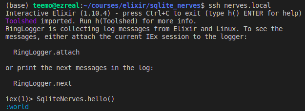

# Using Sqlite3 and ecto with nerves

### Preface
For this tutorial we'll be using sqlite_ecto2 library on a raspberry pi. If you're new to nerves and
IOT then this can be a lot more challenging as I learned it the hard way. Important tip, while working
if you mess something up, don't know the current state of your project or want to start the compiling
stuff from the start `mix deps.clean --all` and `mix clean` are your best friends. 

### Introduction
Our application will have 2 major components. First dealing with nerves side of things, like setting up 
a Nerves application and burning firmware to the device over WiFi. Second deals with Sqlite and Ecto 
side of things, like setting up configuring and database.

### Getting Started
First we'll setup our Nerves side of the application, make sure we can ssh into raspberry pi 4 and then
we'll setup sqlite. Create a nerves project with Mix command: `mix nerves.new sqlite_nerves`. Set the
enviroment variable. `export MIX_TARGET=rpi4` then to install all the deps `mix deps.get`

**Note** Setting of the `MIX_TARGET` might seem trivial but it is really important as `mix` will
compile/ install the dependencies accordingly.

#### Configure the WiFi configs/target.exs
Replace the default `{"wlan0", %{type: VintageNetWiFi}}` struct with the following. For simplicity, 
we'll be hardcoding the network name and password.
```elixir
    {"wlan0", %{type: VintageNetWiFi,
      vintage_net_wifi: %{
      networks: [
        %{
          key_mgmt: :wpa_psk,
          ssid: "<network_name>",
          psk: "<network_password>"
          }]
        },
        ipv4: %{method: :dhcp}
      }
    }
```

#### Enable software updates for streamlined developer experience 
* Generate ssh keys (google how to create), use default names for the files id_rsa.pub etc.
* If you already have ssh keys, make sure the path in config/target.exs are correct.
* We have nerves_pack dependency which include networking and ssh support both for debugging and 
updates.
* Generate the upload.sh script by running `mix firmware.gen.script`

#### Bundle the firmware
To build the firmware run the following command
`mix firmware`

#### Burn the SD card
To burn the firmware on SD card, insert your SD card in the computer then
`mix firmware.burn`
If it says cannot detect SD card: for linux use command `mix firmware.burn -d <location of SD card>` in 
my case it was `/dev/mmcblk0` you can check your from Disks utility in Ubuntu.
`mix firmware.burn -d /dev/mmcblk0`
Now insert the SD card in rpi4 and boot it up

#### Pinging device and debuggin to see if it comes online
By default nerves device is available on the network with `nerves.local` name. To check if device has
 come online, ping it from terminal
`ping nerves.local`
some times this doesn't work due to some router issue or what not. In this case it would be helpful if 
you are able to know the ip address of you device. For this connect your raspberry pi to a display. Next
you'll need to configure the logger. In `config.exs` add `:console` in front of config logger.
```elixir
    config :logger, backends: [:console, RingLogger]
``` 

#### Connect to device over ssh
`ssh nerves.local` or if this dosen't work then `ssh <ip_address>` which you can discover from the 
console logs. This will drop in the iex shell where we can run all the elixir commands for dev and testing.


#### Additional functionality
There is blinky code in the repository, which I will not go over here. You can find it in the 
`led_controller` module.

#### Important note before starting sqlite moudle
Remember when we set the `MIX_TARGET=rpi4` we need to change it to host if we want to test our sqlite 
implementation on our host machine. so run `export MIX_TARGET=host` and `mix deps.clean --all` finally 
`mix deps.get` to compile sqlite and ecto for the host machine. Before uploading your firmware onto the
device remember to change the target to `rpi4` and recompile otherwose you'll get errors on raspberry 
pi.

### Starting Sqlite-Ecto module
First add `sqlite_ecto2` dependency in `mix.exs`.
```elixir
    def deps do
    [ 
        # ... other dependencies
        {:sqlite_ecto2, "~> 2.4"} 
    ]
    end
```
Now download your denpendencies and ensure that you can compile your Ecto repository.

    $ mix deps.get
    $ mix ecto.gen.repo -r SqliteNerves.Repo

Next edit the `SqliteNerves.Repo` module in `lib/sqlite_nerves/repo.ex` to use the `sqlite_ecto2` adapter.

```elixir
    defmodule SqliteNerves.Repo do
        use Ecto.Repo, otp_app: :sqlite_nerves, adapter: Sqlite.Ecto2
    end
```
Now open your `config/config.exs` and configure Ecto and our new adapter.

```elixir
config :sqlite_nerves, SqliteNerves.Repo,
    adapter: Sqlite.Ecto2,
    database: "#{Mix.env}_db_name.sqlite3"

config :sqlite_nerves, ecto_repos: [SqliteNerves.Repo]
```

`adapter: Sqlite.Ecto2` tells Ecto to use the SQLite adapter we just installed. 
`database: "..db_name.."`
tells the adapter path and name of the file that will contain our database, note in this case this file 
will be created in
the top level directory. Adding the `:ecto_repos` key with `[Blog.Repo]` tells Ecto's `mix` tasks about 
the `Blog.Repo` database.

Another thing to watchout is db file `dev_db_name...` is at the root of our project, which is read-only 
in
Nerves device, thus SQLite won't be able to write to this directory. we'll fix this later for now carry 
on.

Finally in `lib/sqlite_nerves/application.ex` add `SqliteNerves.Repo` in children list to start the 
Ecto repo
when the application starts:
```elixir
# ...
children = [
    SqliteNerves.Repo,
]
```

Test everything with `mix ecto.create` and verify the SQLite database has been created in the top level 
directory with the name `dev_db_name.sqlite3` (or whatever you've configured in `config.exs`).

#### Ecto Models
Having configured and created our database we can now create tables to hold our data. We'll be creating a 
"users" table. Run `mix ecto.gen.migration create_users`. This will create a file at 
`priv/repo/migrations/TIMESTAMP_create_users.exs` where TIMESTAMP is the particular date and time you 
ran the migration command. Edit this file to create the new table:
```elixir
defmodule Blog.Repo.Migrations.CreateUsers do
  use Ecto.Migration

  def change do
    create table(:users) do
      add :name, :string
      add :email, :string
      timestamps()
    end
  end
end
```

Migrations command creates a file that holds table's schema. Here we have specified that we want 
a table with name 'users' and have added columns for user's name and email address. The `timestamps()`
statement will create 2 columns to mark when entries have been inserted or updated.

Run `mix ecto.migrate` to create the new table. To verify the create table run `sqlite3 dev_db_name.sqlite3 .schema`

```
teemo@ezreal:~/courses/elixir/sqlite_nerves$ sqlite3 dev_db_name.sqlite3 .schema
CREATE TABLE IF NOT EXISTS "schema_migrations" ("version" BIGINT PRIMARY KEY, "inserted_at" NAIVE_DATETIME);
CREATE TABLE IF NOT EXISTS "users" ("id" INTEGER PRIMARY KEY, "name" TEXT, "email" TEXT, "inserted_at" NAIVE_DATETIME NOT NULL, "updated_at" NAIVE_DATETIME NOT NULL);
```

Before we can use the table. We have to write an Ecto model to encapsulate it. Create `lib/sqlite_nerves/user.ex`
to define the model and add:
```elixir
defmodule SqliteNerves.User do
  use Ecto.Schema

  schema "users" do
    field :name, :string
    field :email, :string
    timestamps()
  end
end
```

Notice how it resembles the migration we just wrote. Let's quickly make sure the model is working with iex:
```bash
teemo@ezreal:~/courses/elixir/sqlite_nerves$ iex -S mix
Erlang/OTP 23 [erts-11.1] [source] [64-bit] [smp:4:4] [ds:4:4:10] [async-threads:1] [hipe]
Interactive Elixir (1.10.4) - press Ctrl+C to exit (type h() ENTER for help)
 ❄ Good Luck with Elixir ❄
iex(1)> SqliteNerves.Repo.insert(%SqliteNerves.User{name: "Ashe", email: "league@example.com"})      

19:50:52.550 [debug] QUERY OK db=19.1ms
INSERT INTO "users" ("email","name","inserted_at","updated_at") VALUES (?1,?2,?3,?4);
--RETURNING ON INSERT "users","id" ["league@example.com", "Ashe", {{2020, 11, 2}, {14, 50, 52, 520401}}, 
{{2020, 11, 2}, {14, 50, 52, 523120}}]
{:ok,
 %SqliteNerves.User{
   __meta__: #Ecto.Schema.Metadata<:loaded, "users">,
   email: "league@example.com",
   id: 2,
   inserted_at: ~N[2020-11-02 14:50:52.520401],
   name: "Ashe",
   updated_at: ~N[2020-11-02 14:50:52.523120]
 }}

iex(2)> import Ecto.Query
 Ecto.Query

iex(3)> SqliteNerves.Repo.all(SqliteNerves.User |> select( [user], user.name ))

19:51:52.518 [debug] QUERY OK source="users" db=1.9ms queue=0.2ms
SELECT u0."name" FROM "users" AS u0 []
["Ashe"]
```

#### More on SQLite Database Features
For more advance features of SQLite refer to the sqlite_ecto2 
[tutorial](https://github.com/elixir-sqlite/sqlite_ecto2/blob/master/docs/tutorial.md), 
section 'Associations' on github.
Link to repo is also in the references section.

### Database Setup for embedded device raspberry pi.
Remember that the root directory of our project on Nerves deivce is read-only, so we have to fix that
now. The fix is simple change the file location to `/root/` like so
`database: "/root/#{Mix.env}_db_name.sqlite3"`

Sadly we can't celebrate just yet as there is one more thing we need to do before we can deploy this
database on our device. See we have a database file created on our host device, but how are we going to
get that file on our Nerves device ? We can use `mix` maybe, unfortunately when we'll deploy the 
firmware on our device we won't have Mix Tasks available.

**Note:** There are a number of ways to possibly accomplish getting your database setup in Nerves, and
this is by no means the only way. 

Naturally we should just be able to run the Mix Tasks from our application code. Unfortunately this
won’t work. The Ecto tasks rely on things that just aren’t available in our Nerves release. So we will
have to implement them a little bit manually.

Credits: This code is borrowed from [this tutorial](https://embedded-elixir.com/post/2017-09-22-using-ecto-and-sqlite3-with-nerves/)
```elixir
@otp_app Mix.Project.config[:app]

def start(_type, _args) do
    ...
    :ok = setup_db!()
    ...
end

defp setup_db! do
  repos = Application.get_env(@otp_app, :ecto_repos)
  for repo <- repos do
    if Application.get_env(@otp_app, repo)[:adapter] == Sqlite.Ecto2 do
      setup_repo!(repo)
      migrate_repo!(repo)
    end
  end
  :ok
end

defp setup_repo!(repo) do
  db_file = Application.get_env(@otp_app, repo)[:database]
  unless File.exists?(db_file) do
    :ok = repo.__adapter__.storage_up(repo.config)
  end
end

defp migrate_repo!(repo) do
  opts = [all: true]
  {:ok, pid, apps} = Mix.Ecto.ensure_started(repo, opts)

  migrator = &Ecto.Migrator.run/4
  pool = repo.config[:pool]
  migrations_path = Path.join([:code.priv_dir(@otp_app) |> to_string, "repo", "migrations"])
  migrated =
    if function_exported?(pool, :unboxed_run, 2) do
      pool.unboxed_run(repo, fn -> migrator.(repo, migrations_path, :up, opts) end)
    else
      migrator.(repo, migrations_path, :up, opts)
    end

  pid && repo.stop(pid)
  Mix.Ecto.restart_apps_if_migrated(apps, migrated)
end
```

#### References
I would like to mention 2 reources that I followed heavily for making this tutorial. They both
had few things missing which I thought of adding and so I combined the two and slighty improved em
IMHO.
1. [sqlite_ecto2 github repository.](https://github.com/elixir-sqlite/sqlite_ecto2/)
2. [Using Ecto and Sqlite3 with Nerves, by Connor Rigby.](https://embedded-elixir.com/post/2017-09-22-using-ecto-and-sqlite3-with-nerves/)